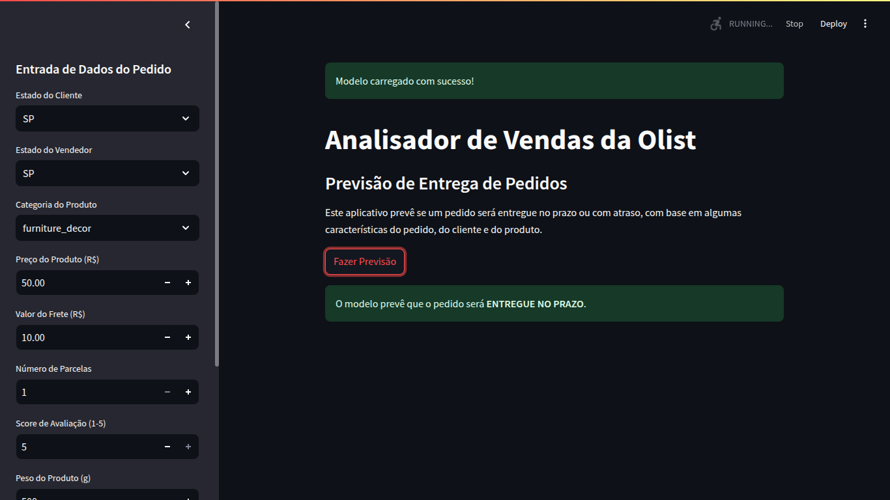

# Analisador de Vendas da Olist

Este é um projeto de Machine Learning e Data Science, focado na previsão de atrasos em entregas de pedidos no e-commerce brasileiro. O projeto utiliza um dataset público da Olist e é estruturado para seguir as melhores práticas de Engenharia de Machine Learning (MLOps).

## Funcionalidades do Projeto

O objetivo principal deste projeto é construir um **modelo de classificação** que prevê se um pedido será entregue **no prazo** ou **com atraso**. Para isso, o projeto cobre o ciclo de vida completo do desenvolvimento de um modelo, incluindo:

  - **Engenharia de Features:** Pré-processamento e criação de variáveis mais robustas a partir dos dados brutos, como o tempo de aprovação de pagamento e de envio para a transportadora.
  - **Experimentação e Otimização:** Experimentação com múltiplos modelos de classificação (Regressão Logística, Árvore de Decisão e Random Forest) e comparação de suas métricas de desempenho.
  - **Tratamento de Dados Desbalanceados:** Aplicação da técnica de **SMOTE** para balancear o conjunto de dados e melhorar a capacidade do modelo de prever a classe minoritária (pedidos com atraso).
  - **Treinamento de Modelo:** Construção de um pipeline de Machine Learning robusto com `scikit-learn` e `imbalanced-learn`.
  - **Modularização do Código:** Código organizado em módulos Python para facilitar a manutenção e o reuso.
  - **Aplicação Web Interativa:** Um dashboard construído com `Streamlit` que permite a interação com o melhor modelo para fazer previsões em tempo real.

## Estrutura do Repositório

O projeto é organizado em uma estrutura modular para replicar um ambiente de produção:

```
Brazilian_E-Commerce/
├── data/
│   ├── raw/           (dados brutos, ignorado pelo Git)
│   └── processed/     (dados limpos e prontos para o modelo, ignorado pelo Git)
│
├── notebooks/         (notebooks para exploração e experimentação)
│   └── model_classification.ipynb
│
├── models/            (modelos treinados salvos como .pkl, ignorado pelo Git)
│   └── logistic_regression_model.pkl
│
├── src/               (código fonte do projeto)
│   ├── etl/           (scripts para extração e carregamento de dados)
│   ├── features/      (scripts para engenharia de features)
│   ├── models/        (scripts de treino e avaliação de modelos)
│   └── dashboard/     (código da aplicação web Streamlit)
│
├── .gitignore         (arquivo que define quais arquivos o Git deve ignorar)
├── README.md          (documentação do projeto)
└── requirements.txt   (lista de bibliotecas necessárias)
```

## Como Rodar o Projeto

Para testar o projeto localmente, siga os passos abaixo:

1.  **Clone o Repositório**
    Abra seu terminal e clone o projeto:

    ```bash
    git clone https://github.com/<seu-usuario>/<seu-repositorio>.git
    ```

2.  **Crie e Ative um Ambiente Virtual**
    A melhor prática é criar um ambiente virtual para evitar conflito de bibliotecas.

    ```bash
    python -m venv venv
    source venv/bin/activate
    ```

3.  **Instale as Dependências**
    Instale todas as bibliotecas necessárias para o projeto:

    ```bash
    pip install -r requirements.txt
    ```

4.  **Baixe o Dataset**
    O conjunto de dados público da Olist não está incluído no repositório. Baixe-o do Kaggle e salve os arquivos `.csv` na pasta `data/raw/`.

    [**Dataset da Olist no Kaggle**](https://www.kaggle.com/datasets/olistbr/brazilian-ecommerce)

5.  **Treine o Modelo**
    Execute o script de treinamento a partir da **pasta raiz** do projeto. Isso processará os dados, treinará o modelo e o salvará na pasta `models/`.

    ```bash
    python -m src.models.train
    ```

6.  **Execute o Dashboard**
    Inicie a aplicação web do Streamlit com o seguinte comando, executado também a partir da **pasta raiz**:

    ```bash
    streamlit run src/dashboard/app.py
    ```

    O aplicativo abrirá automaticamente no seu navegador, permitindo que você interaja com o modelo.

## Dashboard da Aplicação

O dashboard do Streamlit fornece uma interface simples e intuitiva para fazer previsões com o modelo otimizado.



## Tecnologias Utilizadas

  * **Python**: A linguagem principal do projeto.
  * **Pandas**: Manipulação e análise dos dados.
  * **Scikit-learn** & **Imbalanced-learn**: Construção do pipeline e treinamento do modelo.
  * **Streamlit**: Criação da aplicação web interativa.
  * **Git**: Controle de versão do código.
